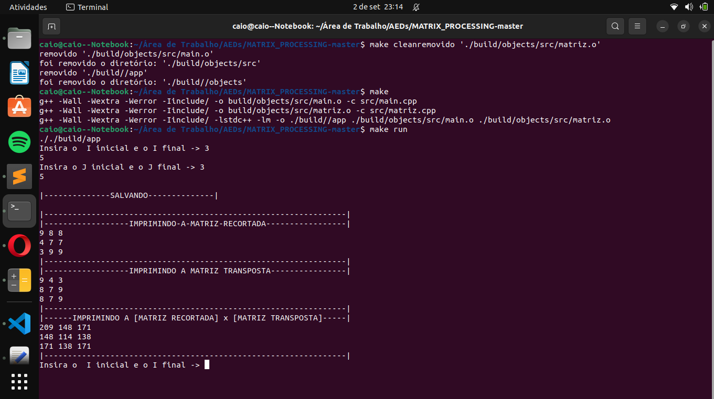

# Processamento de matrizes por segmentação de arquivo	

  
</a> 
</div>

<h2><a>Como usar?</a></h2>

<p> 
Utilizar o arquivo Matriz.txt para colocar a matriz que deseja é seus valores devem ser de 0-9.

Mudar o if(aux >= 10) para o valor da sua matriz quadrada no exemplo utilizamos uma 10x10.

Digitar as coordenadas de recorte manualmente.
</p>

<p align="center">

</p>

<h2><a>Exemplo de funcionamento</a></h2>

<p>Utilizamos a matriz abaixo 10x10 como inicial.</p>

<p align="center">

</p>

<p>O usuário digitou as coordenadas iniciais e finais para i e j. Esperamos a determinada matriz como retorno de acordo com essas respectivas coordenadas. Logo em seguida calculamos sua transposta e a mutiplicação do seu reporte pela transposta encontrando assim a matriz final da imagem.</p>

<p align="center">

</p>

<p>Caso o usuário digita as mesmas coordenadas o programa reimprimi a sua mutiplicação apontando assim sua já existência na hash.</p>

<p align="center">

</p>

<h2><a>Objetivo</a></h2>

<p>O objetivo proposto pelo trabalho é implementar um sistema de multiplicação de matrizes com base em uma estratégia de segmentação em arquivo. Sendo assim, ler à partir de documentos textos coordenadas para recortar uma matriz filha de uma matriz mãe na qual está em um documento txt. Após recortamos a matriz filha, calculamos sua transposta e por fim, multiplicamos a matriz filha recortada pela sua matriz originando uma terceira matriz que será armazenada em uma tabela hash.</p>

<h2><a>Explicando o código</a></h2>

<h2><a>Leitura</a></h2>

```c++
void LeituraMatriz(Matriz *mat, int i_inicial, int i_final, int j_inicial, int j_final){

    ifstream arq;

    arq.open("Matriz.txt");

    int a = 0;
    string linha;
    int cont = 0;
    int numero_elementos = (i_final - i_inicial + 1) * (j_final - j_inicial + 1), vetor[numero_elementos], aux = 0;

    if(arq.is_open()){
        for(int i = 0; i < i_inicial - 1; i++){
            getline(arq, linha);
        }

            while(!arq.eof()){
                while(getline(arq, linha, ' ') && cont < numero_elementos){
                    aux++;

                    if(aux >= j_inicial && aux <= j_final){
                        vetor[a] = stoi(linha);
                        a++;
                        cont++;
                    }

                        if(aux >= 10){
                            aux = 0;
                        }
                }
            }
    }

    int linhas = i_final - (i_inicial - 1);
    int colunas = j_final - (j_inicial - 1);
    int matriz[linhas][colunas];

    int k = 0;

    for(int i = 0; i < linhas; i++){
        for(int j = 0; j < colunas; j++){
            matriz[i][j] = vetor[k];
            mat->matriz[i][j] = matriz[i][j];
            k++;
        }
    }

    arq.close();

}
```

<p>A função leitura abre o documento texto recebe as coordenadas digitadas pelo o usuário e lê linha por linha tokenizando e salvando como uma string, transformando essa string um vetor de inteiros que posteriormente é transformado em uma matriz. Dessa forma, temos nossa matriz recortada.</p>

<h2><a>Transposta</a></h2>

```c++

 void CriaTransp(Matriz *mat, int i_inicial, int i_final, int j_inicial, int j_final){

    int linhas = i_final - (i_inicial - 1);
    int colunas = j_final - (j_inicial - 1);

    for(int i = 0; i < linhas; i++){
        for(int j = 0; j < colunas; j++){
            mat->transposta[j][i] = mat->matriz[i][j];
        }
    }
}
```

<p>A função transposta recebe nossa matriz recortada e inverte linha por coluna transformando assim em uma matriz transposta da recortada.</p>

<h2><a>Multiplicação</a></h2>

```c++
  void CriaMultiplicada(Matriz *mat, int i_inicial, int i_final, int j_inicial, int j_final, unordered_map<string, int**> *hash, string chave){

    int linhas = i_final - (i_inicial - 1);
    int colunas = j_final - (j_inicial - 1);

    int** multiplicada = 0;
    multiplicada = new int * [linhas];
    mat->multiplicada = new int * [linhas];
    int soma;

    for(int i = 0; i < linhas; i++){
        multiplicada[i] = new int[linhas];
        mat->multiplicada[i] = new int[linhas];
        for(int j = 0; j < linhas; j++){
            soma = 0;
            for(int k = 0; k < colunas; k++){
                soma += mat->matriz[i][k] * mat->transposta[k][j];
            }
            multiplicada[i][j] = soma;
            mat->multiplicada[i][j] = soma;
        }
    }

    hash->emplace(chave, multiplicada);
}
```

<p>A função mutiplicada calcula a mutiplicação da matriz recortada pela a matriz transposta</p>

<h2><a>Armazenando na Hash</a></h2>

```c++
int main(){

    Matriz mat;

    unordered_map<string,int**> hash;
    int** aux;

    string chave;

    int i_i, i_f, j_i, j_f;

    while (true) {
        cout << "Insira o  I inicial e o I final -> ";
        cin >> i_i >> i_f;
        cout << "Insira o J inicial e o J final -> ";
        cin >> j_i >> j_f; 
        cout << endl;

        chave = to_string(i_i) + to_string(i_f) + to_string(j_i) + to_string(j_f);

        auto verificar = hash.find(chave);

        if(verificar != hash.end()){
            for (auto verificar_2: hash) {
                if (verificar_2.first == chave) {
                    aux = verificar_2.second;
                }

                for (int i = 0; i < (i_f - i_i + 1); i++) {
                    for (int j = 0; j < (j_f -j_i + 1); j++) {
                        cout << aux[i][j] << " ";
                    }

                    cout << endl;
                }
            }
        }else{
            cout << "|--------------SALVANDO--------------|" << endl << endl;
            LeituraMatriz(&mat, i_i, i_f, j_i, j_f);
            CriaTransp(&mat, i_i, i_f, j_i, j_f);
            CriaMultiplicada(&mat, i_i, i_f, j_i, j_f, &hash, chave);

            Imprimi(&mat, i_i, i_f, j_i, j_f);
        }
    }


    return 0;
}
```
<p>O armazenamento da mutiplicação das matrizes dentro de uma hash ocorre na main onde utilizamos a função pronta unordered_map</p>


<h2><a>Compilando</a></h2>


| Comando                |  Função                                                                                           |                     
| -----------------------| ------------------------------------------------------------------------------------------------- |
|  `make clean`          | Apaga a última compilação realizada contida na pasta build                                        |
|  `make`                | Executa a compilação do programa utilizando o g++, e o resultado vai para a pasta build           |
|  `make run`            | Executa o programa da pasta build após a realização da compilação                                 |

<h2><a>Dados</a></h2>

<p>Disciplina: Algoritmos e Estrutura De Dados II 2022-2

Aluno: Caio Fernando Dias

Professor: Michel Pires

Data: 02/09/2022</p>

<h2><a>Contato</a></h2>

<div> 
  <a href="https://www.instagram.com/caio_fer_dias/" target="_blank"></a>
  <a href = "mailto:caiodias200109@gmail.com"></a>
  <a href="https://www.linkedin.com/in/caio-dias-8a4962246/" target="_blank"></a>
  <a href="https://t.me/caio_fer_dias" target="_blank"></a>
  <a href="https://www.facebook.com/caiofernando.dias.77"></a>
  <a href="https://github.com/Caio-Fernando-Dias"></a>
</div>

